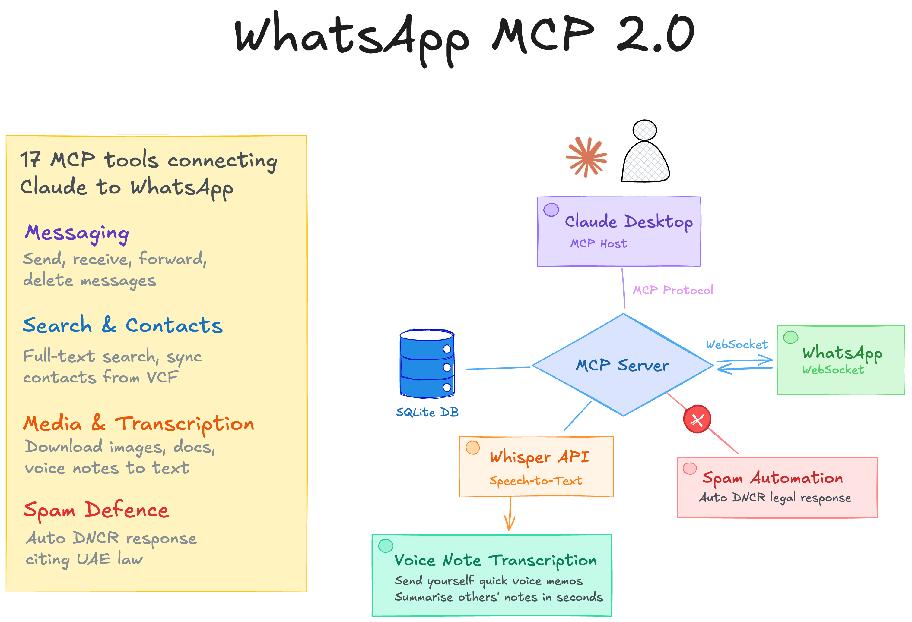

# WhatsApp MCP 2.0

A Model Context Protocol (MCP) server that connects to WhatsApp via [Baileys](https://github.com/WhiskeySockets/Baileys), providing AI with the ability to manage WhatsApp.



## Features

- List and search chats, contacts, and messages
- Send text messages and files (images, videos, documents, audio)
- Download media from received messages
- Transcribe voice notes via Whisper-compatible API (Groq, OpenAI)
- Reply to spam with UAE DNCR violation warning
- Full-text message search across all chats or within a specific chat
- Automatic history sync on first pairing (QR scan)
- Multi-instance safe: only one process connects to WhatsApp; extras run read-only from SQLite
- Contact name import from phone address book via VCF file

## Prerequisites

- Node.js 18+
- A WhatsApp account with an active phone number

## Setup

```bash
# Install dependencies
npm install

# Build
npm run build

# Start the server
npm start
```

On first run, a QR code is printed to stderr. Scan it with WhatsApp on your phone:

**WhatsApp > Settings > Linked Devices > Link a Device**

After scanning, the server syncs your chat history and begins listening for new messages. Authentication credentials are saved to `auth_info/` so subsequent starts reconnect automatically.

## MCP Client Configuration

Add the server to your MCP client config (e.g. Claude Desktop `claude_desktop_config.json`):

```json
{
  "mcpServers": {
    "whatsapp": {
      "command": "node",
      "args": ["/absolute/path/to/whatsapp-mcp/dist/index.js"],
      "env": {
        "WHISPER_API_URL": "https://api.groq.com/openai/v1/audio/transcriptions",
        "WHISPER_API_KEY": "gsk_your_key_here"
      }
    }
  }
}
```

The `env` block is optional and only needed for voice note transcription (see below).

## Voice Note Transcription

The `transcribe_voice_note` tool uses a Whisper-compatible speech-to-text API to transcribe voice notes. Audio is downloaded from WhatsApp into memory, sent to the API, and discarded — nothing is saved to disk. Transcriptions are cached in the database so repeated calls are instant.

### Configuration

Set these environment variables in the MCP client config `env` block:

| Variable | Required | Description |
|----------|----------|-------------|
| `WHISPER_API_URL` | Yes | API endpoint URL |
| `WHISPER_API_KEY` | Yes | API key |
| `WHISPER_MODEL` | No | Model name (default: `whisper-large-v3`) |

### Groq (recommended — free tier)

```json
"env": {
  "WHISPER_API_URL": "https://api.groq.com/openai/v1/audio/transcriptions",
  "WHISPER_API_KEY": "gsk_..."
}
```

Get a free API key at [console.groq.com](https://console.groq.com).

### OpenAI

```json
"env": {
  "WHISPER_API_URL": "https://api.openai.com/v1/audio/transcriptions",
  "WHISPER_API_KEY": "sk-...",
  "WHISPER_MODEL": "whisper-1"
}
```

## Available Tools

| Tool | Description |
|------|-------------|
| `list_chats` | List chats sorted by last activity, optionally filtered by name |
| `get_chat` | Get chat details with recent messages |
| `list_messages` | Get messages from a chat (newest first) |
| `search_messages` | Full-text search across all chats or a specific chat |
| `search_contacts` | Find contacts by name or phone number |
| `get_message_context` | Get messages surrounding a specific message |
| `get_my_profile` | Get the authenticated user's JID, name, and phone number |
| `update_contact` | Update or set a contact's display name (updates chat listing too) |
| `sync_contacts` | Import phone contacts from a VCF file into the database |
| `send_message` | Send a text message (requires confirmation before sending) |
| `send_file` | Send an image, video, audio, or document file |
| `reply_spam` | Send a UAE DNCR violation response to any unsolicited marketing — estate agents, insurance, car sales, etc. (requires confirmation) |
| `delete_message` | Delete a message for everyone (requires confirmation before deleting) |
| `delete_chat` | Delete an entire chat from WhatsApp and local database (requires confirmation) |
| `download_media` | Download media from a received message to disk |
| `transcribe_voice_note` | Transcribe a voice note to text via speech-to-text API (results cached) |

## Confirmation Flow

The `send_message`, `reply_spam`, `delete_message`, and `delete_chat` tools use a two-step confirmation flow to prevent accidental actions. When called, they first return a preview showing:

- **Recipient name** (from your contacts database)
- **Phone number**
- **Message content** (for sends) or **message ID** (for deletes)

The action is only performed after you confirm. The AI assistant must call the tool a second time with `confirmed: true` to proceed.

## Importing Phone Contacts

WhatsApp does not sync your phone's address book names to linked/companion devices. To see contact names instead of phone numbers, import them from a VCF (vCard) file:

### Export contacts from your phone

**iPhone:** iCloud.com > Contacts > Select All > Export vCard

**Android:** Contacts app > Settings > Export > Export to .vcf file

### Import into the database

```bash
# Place the VCF file in the contacts/ directory (git-ignored)
mkdir -p contacts
cp ~/Downloads/contacts.vcf contacts/

# Preview matches without making changes
npm run import-contacts -- contacts/contacts.vcf --dry-run

# Run the import
npm run import-contacts -- contacts/contacts.vcf
```

The importer matches phone numbers from your address book to existing WhatsApp JIDs in the database using:

1. **Exact matching** — normalized phone number matches a known JID directly
2. **Fuzzy matching** — last 9 digits match, catching local vs. international format differences (e.g. `05xxxxxxxx` vs `9715xxxxxxxx`)

Fuzzy matches are listed separately so you can verify them. Run with `--dry-run` first.

## Project Structure

```
src/
  index.ts          Entry point, lock file, MCP server setup
  whatsapp.ts       Baileys client, event handling, high-level API
  db.ts             SQLite database layer (better-sqlite3)
  tools.ts          MCP tool definitions
  transcribe.ts     Whisper API client for voice note transcription
  utils.ts          Shared helpers (JID conversion, MIME types)
  import-contacts.ts  VCF contact import script

auth_info/          WhatsApp authentication credentials (git-ignored)
store/              SQLite database (git-ignored)
downloads/          Downloaded media files (git-ignored)
contacts/           Imported contact files (git-ignored)
patches/            Baileys patches applied via patch-package
```

### Event Handling

Baileys buffers events during history sync and flushes them as a consolidated map. The server uses `sock.ev.process()` (not individual `.on()` listeners) to receive both buffered and real-time events correctly.

### Multi-Instance Safety

A file lock (`store/.whatsapp.lock`) ensures only one process connects to WhatsApp at a time. Additional instances (e.g. from Claude Desktop spawning multiple MCP servers) run in read-only mode, serving data from SQLite without opening a second WebSocket connection.

### History Sync

On first pairing (QR scan), WhatsApp delivers your chat history in multiple sync events. The server persists all chats, contacts, and messages to SQLite. History sync only happens on first pairing — reconnections reuse the existing database.

## Troubleshooting

**QR code not appearing:** Make sure you're running the server directly (not through an MCP client) so you can see stderr output. Use `npm run dev` for development.

**Status 515 disconnect after initial sync:** This is normal. WhatsApp sends a `restartRequired` signal after the initial data dump. The server automatically reconnects with exponential backoff.

**"Couldn't finish syncing" on phone:** A cosmetic message that appears briefly during first pairing. It clears on its own after the connection stabilizes.

**Status 401 (logged out):** Your session was invalidated. Delete `auth_info/` and re-scan the QR code.

**Chats showing phone numbers instead of names:** WhatsApp doesn't sync address book names to linked devices. Use the VCF contact import feature described above.

## Development

```bash
# Run with hot-reload
npm run dev

# Type-check without emitting
npx tsc --noEmit

# Build for production
npm run build
```

## Disclaimer

This software is provided as-is, without warranty of any kind. The authors take no responsibility for how this code is used. Use at your own risk and in compliance with WhatsApp's Terms of Service and all applicable laws.

## License

MIT
